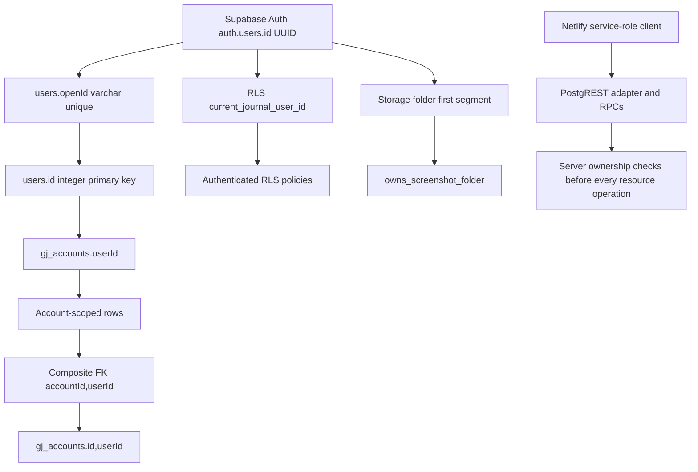

# Gold Journal Supabase/PostgreSQL Audit and Production Hardening Report

**Repository:** `Najam27/gold-journal-`

**Scope:** Supabase Auth, Supabase PostgreSQL, Drizzle metadata, SQL migrations, RLS, Storage, service-role access, query abstraction, transactions, concurrency, data integrity, migration safety, and production configuration.

**Audit basis:** The complete Supabase/PostgreSQL brief (`pasted_content_6.txt`, phases 1–50), the inherited production audit history, repository source, migration history, tests, and release-gate commands executed in the sandbox.

**Status:** Code and migration repairs are complete and pushed to `origin/main`. The local release gate is green. Live Supabase authorization, migration application, EXPLAIN plans, and high-volume database load remain deployment-environment gates because this sandbox has no production Supabase credentials or PostgreSQL client.

## Executive Summary

The audit found and repaired a **real authentication module-cycle defect**, stale MySQL Drizzle migration artifacts, missing database-level domain checks, missing composite ownership constraints in the historical migration path, insufficient notification uniqueness enforcement, exposed anonymous execution privileges on RLS helper functions, incomplete timestamp ownership, an inefficient authentication persistence flow, an unsafe nested PostgREST boolean renderer, and several query-pattern index gaps. The repaired design preserves the intended identity architecture: `auth.users.id` is stored as `users.openId`, while the application uses the integer `users.id` for all account and resource relationships.

The active schema source is now unambiguous. Supabase migrations `0001` through `0006` are the only executable database history; `drizzle/schema.ts` is the PostgreSQL table/type metadata consumed by the adapter and tests, not a migration stream. Composite foreign keys enforce that account-scoped child rows carry the same owner as their parent account. The server still uses a service-role client, so application ownership checks remain mandatory; RLS and Storage policies are defense in depth, not a substitute for server authorization.

> **Release conclusion:** The repository is locally verified and suitable for deployment staging after the six Supabase migrations are applied and the live authorization/Storage matrix is executed. It is not possible to claim production database readiness until those live checks, authenticated database load tests, and secret rotation/history cleanup are completed.

## 1. Architecture and Identity Model

The identity chain is intentional and unchanged. `authenticateSupabaseAccessToken()` verifies the bearer token through Supabase Auth, then upserts the verified Auth UUID into `users.openId`. The returned application user contains the integer `users.id`; tRPC context and all protected procedures use that application ID. No browser-supplied `userId` is accepted as authentication.

The database-side RLS mapping is explicit: `auth.uid()::text → users.openId → users.id`. `users.openId` is unique, and the user upsert uses `onConflict: "openId"`. A deleted or invalid Auth identity fails `auth.getUser()` before application-user persistence is touched. Live verification of deleted-user behavior and concurrent Auth requests remains required against a staging Supabase project.

## 2. Issue Inventory

| Severity | File / function / schema object | Root cause | Current behavior and risk | Fix | Migration required? | Test evidence |
|---|---|---|---|---|---|---|
| **High** | `server/supabase.ts`, `server/db.ts`, `server/userDb.ts`; `authenticateSupabaseAccessToken()` | Authentication imported user persistence from `db.ts`, while `db.ts` imported `getSupabaseAdmin` through `supabase.ts`, creating a circular module graph. | A valid token could reach an unresolved or partially initialized user-persistence dependency at runtime. | Moved user lookup/upsert to leaf module `server/userDb.ts`; `db.ts` now only exposes the adapter and re-exports helpers; Auth imports the leaf module directly. | No | `server/supabase.test.ts`; `pnpm check`; full suite passed. |
| **Medium** | `server/supabase.ts`, `server/userDb.ts`; Auth persistence | Auth performed `getUserByOpenId → upsertUser → getUserByOpenId` on every authenticated request. | Unnecessary database round trips increased latency and contention without improving identity correctness. | `upsertUser()` now uses Supabase upsert with `.select("*").single()` and returns the persisted row in one operation. | No | Valid/invalid token tests; full suite passed. |
| **High** | `drizzle/0000–0008*.sql`, `drizzle/meta/*` | Checked-in Drizzle migration lineage was explicitly MySQL-oriented and did not represent PostgreSQL, RLS, Storage, composite owner FKs, or current Supabase RPCs. | A developer could apply stale migrations or infer a false schema source of truth. | Removed proven-unused legacy migration artifacts; retained `drizzle/schema.ts`; added `drizzle/README.md` stating Supabase migrations are authoritative. | No database migration; repository cleanup | `pnpm schema:audit` reports no stale Drizzle artifacts. |
| **High** | `supabase/migrations/0005_trade_summary.sql`; account-scoped tables | Composite owner constraints were required by the Drizzle model but were not present in the original base migration. | A service-role or direct database write could attempt `accountId` from one owner with `userId` from another. | Added composite FKs for trades, cash movements, goals, skipped trades, daily plans, notification history, and MT5 connections; guarded creation for safe reruns. | Yes: `0005` must be applied | `server/schemaIntegrity.test.ts`; static source audit; live two-user FK test required. |
| **High** | `supabase/migrations/0006_schema_integrity.sql`; domain tables | Several application-level enums and numeric ranges were not enforced by PostgreSQL. | Direct/service-role writes could bypass direction, result, amount, score, role, MT5 status, and closed-position completeness rules. | Added preflight validation followed by idempotent CHECK constraints for confirmed application invariants. | Yes: `0006` | `server/schemaIntegrity.test.ts`; application test suite; live constraint tests required. |
| **Medium** | `supabase/migrations/0006_schema_integrity.sql`; `gj_notification_history` | Goal-alert deduplication relied on procedure logic without a database unique index. | A future write path or a race outside the advisory-lock function could create duplicate `(userId,type)` alerts. | Added duplicate preflight and unique index `gj_notification_user_type_unique`. | Yes: `0006` | Migration source test; concurrent live notification test required. |
| **Medium** | `supabase/migrations/0002_security_rls_and_storage.sql`, `0006_schema_integrity.sql`; RLS helper functions | SECURITY DEFINER helper functions were not explicitly restricted from `public`/`anon` execution. | Anonymous clients could directly invoke helper functions, even though policy predicates themselves returned no user rows. | Revoked `public, anon`; granted execution to `authenticated, service_role` for the four RLS/Storage helper functions. | Yes: `0006` | `server/rlsPolicy.test.ts`; live anonymous direct-function denial required. |
| **Medium** | `server/supabaseQuery.ts`; `renderPostgrestFilter()` | Nested AND/OR filters were rendered inconsistently: AND flattened with `&`, while OR operands could contain ungrouped logical expressions. | Compound filter semantics could change or produce invalid PostgREST expressions when future nested filters were introduced. | Added grouped `and(...)`/`or(...)` operand rendering and preserved structured APIs for direct filters. | No | Four query adapter tests, including nested `AND(OR(...))`, special characters, null, Date, and bigint. |
| **Medium** | `supabase/migrations/0006_schema_integrity.sql`; all tables with `updatedAt` | Database defaults only applied on insert; many update paths did not set `updatedAt`. | Modification timestamps could remain stale and differ by write path. | Added PostgreSQL-owned `gj_set_updated_at()` trigger and idempotent triggers for users, accounts, trades, goals, daily plans, notification settings, MT5 connections, and live positions. | Yes: `0006` | Migration source test; live timestamp trigger test required. |
| **Low/Medium** | `supabase/migrations/0006_schema_integrity.sql`; query-heavy tables | Several verified query patterns lacked matching date/order indexes. | Larger histories could require unnecessary filtering/sorting work. | Added only query-derived indexes for account creation, cash date, goal period, skipped-trade date, daily-plan date, and MT5 close history; mirrored them in Drizzle metadata. | Yes: `0006` | `pnpm schema:audit`; live `EXPLAIN`/`EXPLAIN ANALYZE` required. |
| **Medium** | `package.json`, stale Drizzle metadata | Migration tooling did not provide an active PostgreSQL migration command and the old artifacts implied the wrong dialect. | Fresh developers could use the wrong migration path. | Package scripts now expose `pnpm schema:audit`; README and `drizzle/README.md` explicitly direct all database migration work to Supabase SQL. | No | `pnpm schema:audit` passed. |

## 3. Schema and Relationship Map

| Parent | Child | Required ownership invariant | Enforcement |
|---|---|---|---|
| `users.id` | `gj_accounts.userId` | Account belongs to an existing application user. | Foreign key with `ON DELETE CASCADE`; RLS and server ownership. |
| `gj_accounts(id,userId)` | `gj_trades(accountId,userId)` | Trade owner equals account owner. | Composite FK in `0005`; server checks; RLS. |
| `gj_accounts(id,userId)` | `gj_cash_movements(accountId,userId)` | Cash owner equals account owner. | Composite FK in `0005`; server checks; RLS. |
| `gj_accounts(id,userId)` | `gj_goals(accountId,userId)` | Goal owner equals account owner. | Composite FK in `0005`; server checks; RLS. |
| `gj_accounts(id,userId)` | `gj_skipped_trades(accountId,userId)` | Skipped-trade owner equals account owner. | Composite FK in `0005`; server checks; RLS. |
| `gj_accounts(id,userId)` | `gj_daily_plans(accountId,userId)` | Plan owner equals account owner. | Composite FK in `0005`; server checks; RLS. |
| `gj_accounts(id,userId)` | `gj_notification_history(accountId,userId)` | Account-linked notification owner equals account owner. | Nullable composite FK in `0005`; server checks; RLS. |
| `gj_accounts(id,userId)` | `gj_mt5_connections(accountId,userId)` | MT5 connection owner equals account owner. | Composite FK in `0005`; one connection per account unique index; server checks. |
| `gj_accounts.id` | `gj_mt5_live_positions.accountId` | Live position belongs to an existing account. | Foreign key; RLS; atomic RPC ownership check. |

`gj_mt5_live_positions` does not store `userId`; this is intentional because the account foreign key is the ownership boundary. It cannot form a cross-user pair without first violating the account relationship.

## 4. Constraint, Precision, Nullability, and Default Report

The PostgreSQL schema uses `serial`/integer identifiers, `varchar`/text fields for bounded labels and notes, `timestamptz` for instants, `numeric(14,2)` for money, and `numeric(18,6)` for prices. Application calculations may use JavaScript numbers for display and request validation, but persisted financial values are formatted strings into PostgreSQL `numeric`; database aggregates use PostgreSQL numeric arithmetic.

| Area | Verified state | Decision |
|---|---|---|
| Primary keys | All twelve application tables have integer/serial primary keys; live positions also have a surrogate `id`. | Keep. |
| Auth mapping | `users.openId` is `varchar(128) NOT NULL UNIQUE`; `users.id` is serial primary key. | Keep the intentional UUID-to-integer mapping. |
| Account bootstrap key | Unique `(userId,bootstrapKey)`; nullable key permits multiple NULLs under PostgreSQL semantics. | Accepted because bootstrap key is optional and only one generated bootstrap key is used per owner. |
| MT5 journal ticket | Unique `(accountId,mt5Ticket)` with nullable trade ticket. | Accepted: multiple manual trades may have NULL; non-NULL MT5 tickets cannot duplicate within an account. |
| Daily plan identity | Unique `(userId,accountId,planDate)`. | Keep. Application treats the timestamp as a canonical day key generated by the client; a DATE conversion was not made without a complete timezone migration. |
| Cash amount | `amount > 0`; type is `DEPOSIT` or `WITHDRAW`. | Enforced in `0006`; matches the router’s `money(0.01)`. |
| Trade risk/reward | Nullable but nonnegative; P&L may be negative. | Enforced in `0006`; NULL means the field was not supplied. |
| Scores | Patience, confidence, execution, and overall ratings are 1–5 when present. | Enforced in `0006`; matches application validators. |
| MT5 open/closed state | OPEN permits an OPEN result and null close fields; CLOSED requires close price/time, realized P&L, and terminal result. | Enforced in `0006`; matches ingest and atomic sync payloads. |
| Role | Defaults to `user`; CHECK permits `user` or `admin`. | Enforced in `0006`; no client procedure accepts role changes. |
| Timestamps | Insert defaults use `now()`; PostgreSQL triggers now own `updatedAt`. | Consistent after `0006`. |
| Nullable fields | Screenshot metadata, optional risk/reward, plan scores, read timestamps, MT5 close fields, and optional account-linked notification IDs remain nullable because the application has meaningful absent states. | Keep; nullable uniqueness behavior is documented above. |

## 5. RLS and Service-Role Strategy

All twelve application tables have RLS enabled in `0002`. RLS policies map the Supabase Auth UUID to the application user integer through `current_journal_user_id()`. Account-scoped policies require both application-user ownership and account ownership. Notification history permits `accountId IS NULL` for global notifications, otherwise it requires account ownership. Storage policies use the private `trade-screenshots` bucket and `owns_screenshot_folder()`.

The Netlify backend uses the service-role client and therefore bypasses RLS. Every server procedure performs explicit ownership checks before reading or mutating account-owned resources. Storage upload validates the trade owner before generating a path under `gold-journal/<auth-open-id>/trades/...`; signed URL generation is only called for database rows returned through an owner-scoped query. The service-role key is not included in browser variables or build output by repository search.

The repository now has source-level RLS/Storage coverage and server authorization tests. A live matrix remains mandatory: anonymous, User A, User B, and service-role direct access must be tested against every table and the Storage bucket in a staging Supabase project.

## 6. Query Abstraction and Transaction Model

`server/supabaseQuery.ts` maps Drizzle table metadata to PostgREST table/column names and supports structured `eq`, `like`, `gte`, `and`, `or`, ascending/descending order, counts, bounded ranges, inserts, updates, deletes, upserts, and returning selections. Values are normalized for Date and bigint and escaped for PostgREST delimiter characters. Nested boolean rendering is now grouped.

The adapter intentionally has **no fake `transaction()` method**. Multi-write operations requiring atomicity use PostgreSQL `SECURITY DEFINER` RPCs in `0004` and `0005`: account clearing, account removal, MT5 reconciliation, goal-alert deduplication, and batched goal-alert recording. The financial cash movement endpoint is a single-row insert and does not claim multi-statement atomicity.

Concurrency protection includes database uniqueness, composite ownership FKs, PostgreSQL row locks in destructive account RPCs, advisory transaction locks for goal-alert types, and atomic MT5 position/trade reconciliation. The local suite verifies wrappers and lifecycle behavior; live concurrent inserts/updates must still be executed against Supabase.

## 7. Migration and Drift Report

| Migration | Purpose | Safety status |
|---|---|---|
| `0001_source_gold_journal.sql` | Base PostgreSQL tables, keys, indexes, private bucket, initial Storage policies. | Existing baseline; apply first. |
| `0002_security_rls_and_storage.sql` | Identity mapping functions, RLS enablement/policies, Storage policy replacement. | Existing baseline; apply second. |
| `0003_scale_aggregates.sql` | Service-role-only cash aggregate RPC. | Existing baseline; apply third. |
| `0004_atomic_operations.sql` | Real PostgreSQL atomic account, MT5, and notification RPCs. | Existing baseline; apply fourth. |
| `0005_trade_summary.sql` | Composite owner FKs, full-history trade summary, batched goal alerts. | Guarded constraint creation; apply fifth. |
| `0006_schema_integrity.sql` | Preflighted CHECK constraints, helper privilege tightening, query-derived indexes, alert uniqueness, updatedAt triggers. | Forward-only, preflighted, idempotent where practical; apply sixth. |

The repeatable command `pnpm schema:audit` verifies migration order, absence of stale Drizzle migration artifacts, and agreement of required constraint/index names between `drizzle/schema.ts` and the Supabase migration text. The second post-repair audit passed with all six migrations present, no stale Drizzle artifacts, and no missing expected names.

## 8. Test and Verification Evidence

| Verification | Result |
|---|---|
| `git diff --check` | Passed. |
| `pnpm schema:audit` | Passed: six migrations ordered; stale Drizzle artifacts absent; expected names present in schema and migrations. |
| `pnpm check` | Passed. |
| `pnpm test` | Passed: **54 test files, 158 tests**. |
| `pnpm build` | Passed: Vite frontend and esbuild server bundle completed. |
| Auth mapping tests | Passed: verified-user persistence and invalid-token isolation. |
| Query adapter tests | Passed: four tests covering nested grouping, Date, bigint, null, quote, slash, comma, parentheses, wildcards, newline, and carriage return. |
| RLS/Storage source tests | Passed: all twelve tables, identity mapping, private bucket, and helper privilege source checks. |
| Migration integrity tests | Passed: preflight, CHECK names, notification uniqueness, indexes, updatedAt triggers, and Drizzle metadata alignment. |
| Existing MT5/atomic/storage/authorization tests | Passed within the full suite. |

## 9. Release-Gate Disposition

| Gate | Status | Evidence or required action |
|---|---|---|
| Auth identity model documented | **PASS** | This report and `server/supabase.ts`. |
| Service-role usage audited | **PASS locally** | Source map and ownership checks; live credential review still required. |
| RLS strategy documented | **PASS locally** | `0002`, `server/rlsPolicy.test.ts`; live matrix required. |
| Composite ownership constraints | **IMPLEMENTED** | `0005`; apply and test in staging. |
| Domain CHECK constraints | **IMPLEMENTED** | `0006`; preflight aborts on incompatible rows. |
| Unique constraints and NULL semantics | **PASS by source review** | Verified in base schema and `0006`; staging tests required. |
| Indexes | **PASS by query-pattern review** | `0006` adds verified gaps; EXPLAIN remains required. |
| Numeric precision and timestamps | **PASS by source review** | PostgreSQL numeric fields and `0006` triggers; staging validation required. |
| Storage private and ownership-safe | **PASS locally** | Server signature validation, owner-scoped rows, private bucket policies; live User A/User B test required. |
| Query abstraction | **PASS locally** | Four renderer tests and no dynamic user-controlled table/column names found. |
| Real transactions | **PASS by design** | RPCs in `0004`/`0005`; no fake adapter transaction. |
| Concurrency | **PARTIAL** | Local atomic/rate-limit/lifecycle tests pass; live concurrent database workload remains required. |
| Large-data / EXPLAIN | **PARTIAL** | Application bounds and aggregates are present; no authenticated 1k/10k/100k Supabase dataset or EXPLAIN run was possible in this sandbox. |
| Full local release gate | **PASS** | `pnpm check`, `pnpm test`, `pnpm build`, `pnpm schema:audit`, and `git diff --check`. |

## 10. Remaining Operational Risks and Required Production Actions

First, apply Supabase migrations `0001` through `0006` in order in a staging project and confirm that the `0006` preflight reports no incompatible existing rows. Do not bypass the preflight by manually disabling constraints. Second, execute the live RLS and Storage matrix with anonymous, User A, User B, and service-role clients, including cross-user composite-FK insertion attempts and signed-URL attempts. Third, run authenticated concurrency tests for trade inserts, MT5 upserts, notification writes, daily-plan upserts, and account deletion/clearing, then capture `EXPLAIN ANALYZE` for dashboard, trade history, notification, analytics, and MT5 history queries.

The previously identified bearer-token exposure in Git history remains an operational security item. Rotate the affected credential at its provider, invalidate any associated sessions or keys, and purge the secret from Git history if required by incident response. Verify Netlify environment variables and Supabase service-role key rotation separately; never place those values in `VITE_` variables or browser bundles.

The in-memory rate limiter remains process-local in serverless deployments. Use a distributed limiter or edge control for production abuse resistance. Finally, after staging evidence is complete, deploy the six migrations before the code that calls their RPCs and verify rollback/restore procedures using Supabase backups.

## 11. Final Conclusion

The repository now has a coherent Supabase-only PostgreSQL migration path, explicit application/Auth identity mapping, database-enforced ownership and domain invariants, RLS and Storage defense in depth, real RPC transaction boundaries, safer query rendering, PostgreSQL-owned update timestamps, query-derived indexes, and repeatable schema drift detection. The local code and test release gate is green.

The remaining items are not unexamined code defects; they are live-environment verification and operational security gates that cannot be honestly simulated from this sandbox. Production approval should therefore be **conditional on staging migration application, the four-identity RLS/Storage matrix, authenticated concurrency and EXPLAIN evidence, and secret rotation/history cleanup**.
